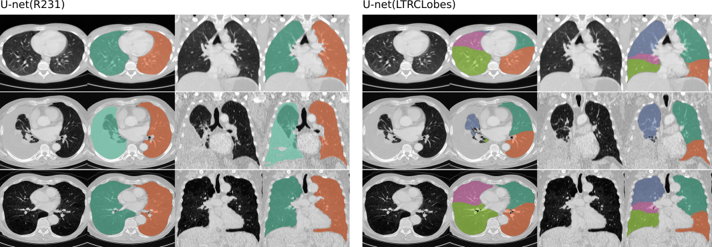
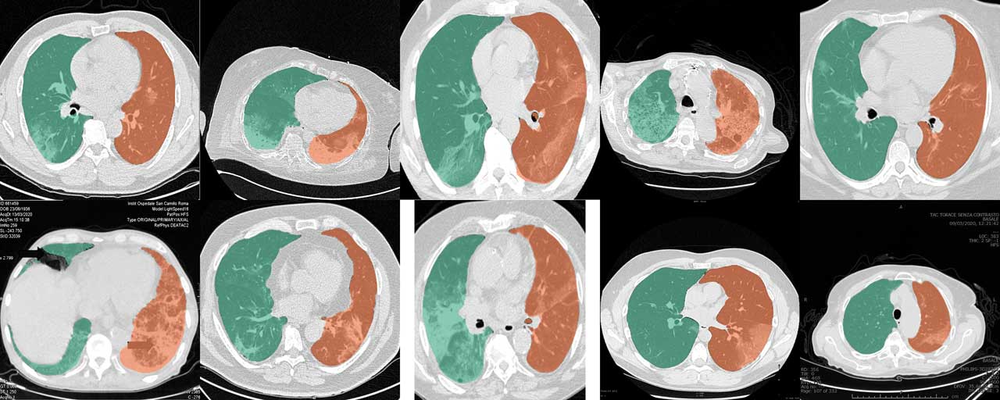

# Automated lung segmentation in CT under presence of severe pathologies

This package provides trained U-net models for lung segmentation. For now, four models are available:

- U-net(R231): This model was trained on a large and diverse dataset that covers a wide range of visual variabiliy. The model performs segmentation on individual slices, extracts right-left lung seperately includes airpockets, tumors and effusions. The trachea will not be included in the lung segmentation. https://doi.org/10.1186/s41747-020-00173-2

- U-net(LTRCLobes): This model was trained on a subset of the [LTRC](https://ltrcpublic.com) dataset. The model performs segmentation of individual lung-lobes but yields limited performance when dense pathologies are present or when fissures are not visible at every slice. 

- U-net(LTRCLobes_R231): This will run the R231 and LTRCLobes model and fuse the results. False negatives from LTRCLobes will be filled by R231 predictions and mapped to a neighbor label. False positives from LTRCLobes will be removed. The fusing process is computationally intensive and can, depdending on the data and results, take up to several minutes per volume.

- [U-net(R231CovidWeb)](#COVID-19-Web)


**Examples of the two models applied**. **Left:** U-net(R231), will distinguish between left and right lung and include very dense areas such as effusions (third row), tumor or severe fibrosis (fourth row) . **Right:** U-net(LTRLobes), will distinguish between lung lobes but will not include very dense areas. **LTRCLobes_R231** will fuse LTRCLobes and R231 results. **R231CovidWeb** is trained with aditional COVID-19 data.



For more exciting research on lung CT data, checkout the website of our research group:
https://www.cir.meduniwien.ac.at/research/lung/

## Referencing and citing
If you use this code or one of the trained models in your work please refer to:

>Hofmanninger, J., Prayer, F., Pan, J. et al. Automatic lung segmentation in routine imaging is primarily a data diversity problem, not a methodology problem. Eur Radiol Exp 4, 50 (2020). https://doi.org/10.1186/s41747-020-00173-2

This paper contains a detailed description of the dataset used, a thorough evaluation of the U-net(R231) model, and a comparison to reference methods.

## Installation
```
pip install lungmask
```
or
```
pip install git+https://github.com/JoHof/lungmask
```
On Windows, depending on your setup, it may be necessary to install torch beforehand: https://pytorch.org

## Runtime and GPU support
Runtime between CPU-only and GPU supported inference varies greatly. Using the GPU, processing a volume takes only several seconds, using the CPU-only will take several minutes. To make use of the GPU make sure that your torch installation has CUDA support. In case of cuda out of memory errors reduce the batchsize to 1 with the optional argument ```--batchsize 1```

## Usage
### As a command line tool:
```
lungmask INPUT OUTPUT
```
If INPUT points to a file, the file will be processed. If INPUT points to a directory, the directory will be searched for DICOM series. The largest volume found (in terms of number of voxels) will be used to compute the lungmask. OUTPUT is the output filename. All ITK formats are supported.

Choose a model: <br/>
The U-net(R231) will be used as default. However, you can specify an alternative model such as LTRCLobes...

```
lungmask INPUT OUTPUT --modelname LTRCLobes
```

For additional options type:
```
lungmask -h
```

### As a python module:

```
from lungmask import mask
import SimpleITK as sitk

input_image = sitk.ReadImage(INPUT)
segmentation = mask.apply(input_image)  # default model is U-net(R231)
```
input_image has to be a SimpleITK object.

Load an alternative model like so:
```
model = mask.get_model('unet','LTRCLobes')
segmentation = mask.apply(input_image, model)
```

To use the model fusing capability for LTRCLobes_R231 use:
```
segmentation = mask.apply_fused(input_image)
```

#### Numpy array support
As of version 0.2.9, numpy arrays are supported as input volumes. This mode assumes the input numpy array has the following format for each axis:
* first axis containing slices
* second axis with chest to back
* third axis with right to left 

## Limitations
The model works on full slices only. The slice to process has to show the full lung and the lung has to be surrounded by tissue in order to get segmented. However, the model is quite stable to cases with a cropped field of view as long as the lung is surrounded by tissue. 

## COVID-19 Web
```
lungmask INPUT OUTPUT --modelname R231CovidWeb
```
The regular U-net(R231) model works very well for COVID-19 CT scans. However, collections of slices and case reports from the web are often cropped, annotated or encoded in regular image formats so that the original hounsfield unit (HU) values can only be estimated. The training data of the U-net(R231CovidWeb) model was augmented with COVID-19 slices that were mapped back from regular imaging formats to HU. The data was collected and prepared by MedSeg (http://medicalsegmentation.com/covid19/). While the regular U-net(R231) showed very good results for these images there may be cases for which this model will yield slighty improved segmentations. Note that you have to map images back to HU when using images from the web. This [blog post](https://medium.com/@hbjenssen/covid-19-radiology-data-collection-and-preparation-for-artificial-intelligence-4ecece97bb5b) describes how you can do that. Alternatively you can set the ```--noHU``` tag.


## jpg, png and non HU images
As of version 0.2.5 these images are supported. Use the ```--noHU``` tag if you process images that are not encoded in HU. Keep in mind that the models were trained on proper CT scans encoded in HU. The results on cropped, annotated, very high and very low intensity shifted images may not be very reliable. When using the ```--noHU``` tag only single slices can be processed.
